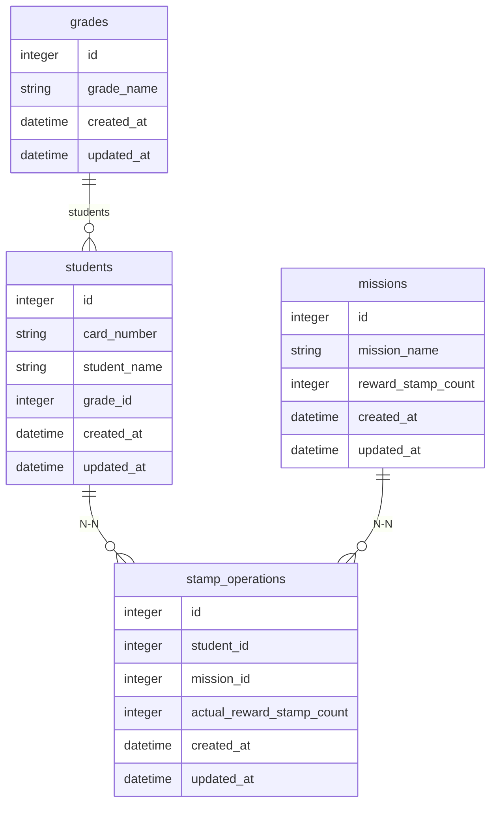

# ER図

```mermaid
erDiagram

grades {
  integer id
  string grade_name
  datetime created_at
  datetime updated_at
}

students {
  integer id
  string card_number
  string student_name
  integer grade_id
  datetime created_at
  datetime updated_at
}

missions {
integer id
string mission_name
integer reward_stamp_count
datetime created_at
  datetime updated_at
}

stamp_operations {
  integer id
  integer student_id
  integer mission_id
  integer actual_reward_stamp_count
  datetime created_at
  datetime updated_at
}

students ||--o{ stamp_operations : N-N
missions ||--o{ stamp_operations : N-N
grades ||--o{ students : students

```
